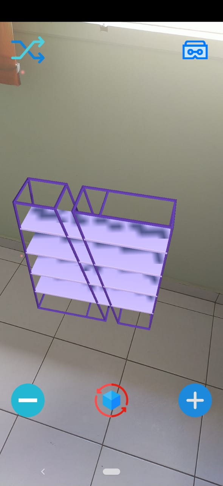
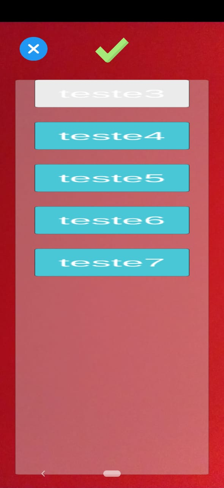

# Projeto de Realidade Mista.
	Software desenvolvido com o intuito de criar objetos 3d em tempo de execução, através de requisições para um servidor.

## Screenshots

## Funcionalidades

### Download e criação de arquivos 3d do tipo obj
### Requisição ao servidor para lista de objetos disponíveis
### Manipulação de tamanho do objeto e rotação
### Visualização no modo VR(Cardboard)
